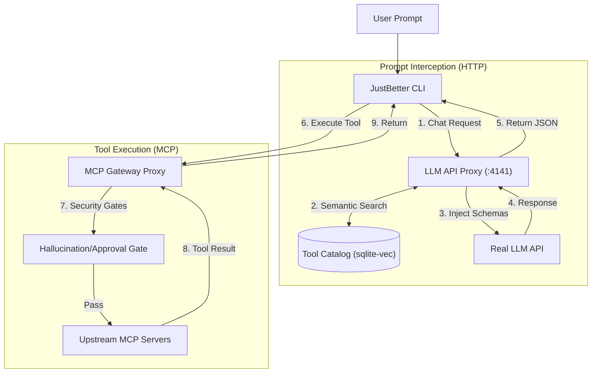
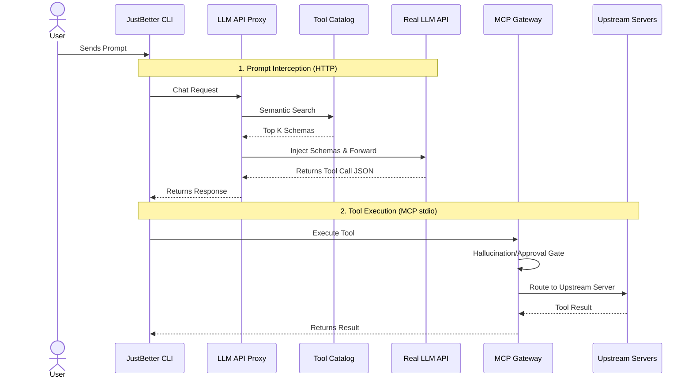
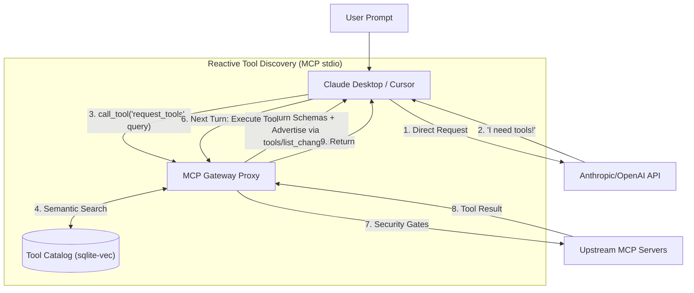
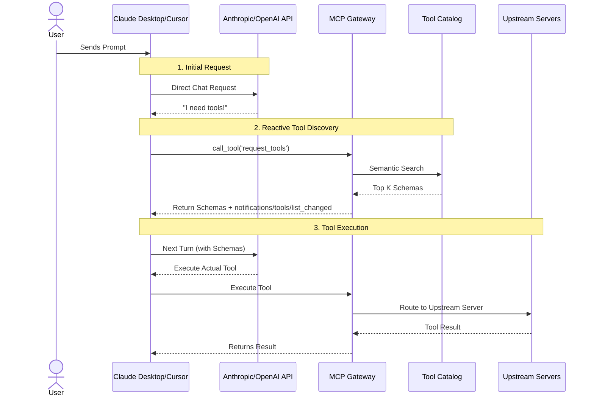

<div align="center">
  <h1>JustBetter MCP</h1>
  <p><em>An MCP gateway with dynamic, retrieval-based tool injection.</em></p>
  <p>
    <a href="https://www.npmjs.com/package/justbetter-mcp"></a>
    
    
    
    
    
  </p>
</div>

<br/>

> **The Problem:** 
> Connecting an LLM to standard Model Context Protocol (MCP) servers (like a file system, a web searcher, and a database) dumps dozens or hundreds of tools into the LLM's context window. 
>
> This token-bloat problem leads to `node_modules` blowups, context limits being breached, and severely degraded tool selection accuracy.

> **The Solution:** 
> JustBetter MCP solves this by acting as a gateway/proxy. Instead of dumping every connected server's tools into every request, it uses dynamic, retrieval-based tool injection to limit the tools sent to the LLM. 
>
> It operates in two main modes: **Mode 2** is essentially equivalent to Anthropic's MCP Tool Search or OpenAI Codex's tool search, where the LLM reactively asks for tools mid-conversation. **Mode 1** is our custom approach that performs semantic retrieval on the raw prompt *before* the first LLM call. Mode 1 achieves almost the same results but can perform better, as the LLM doesn't have to spend inference time thinking about what tools to search for. For more details on this performance difference, see the [Token Usage Analysis](#token-usage-analysis) section.

---

## Install

```bash
npx justbetter-mcp
```

The first run opens a setup wizard: pick a provider, paste an API key (verified against the
provider before it is saved), choose a model, and choose which folder the agent is allowed to
read and write. There is no JSON to hand-author.

**Mode 2 — Claude Desktop, Cursor, or any MCP client.** Add this to the client's MCP config:

```json
{
  "mcpServers": {
    "justbetter": {
      "command": "npx",
      "args": ["-y", "justbetter-mcp", "gateway"]
    }
  }
}
```

The client starts with `request_tools`, `batch_call` and your pinned tools. Everything else is
retrieved on demand: when `request_tools` finds something, its schema is added to the server's
tool list and the client is notified — that is the whole point.

> **Mode 1 needs a client that lets you set an OpenAI-compatible base URL.** The bundled TUI is
> the reference client and always works. Cline, Roo, Continue, aider and Zed accept a custom base
> URL; Cursor is inconsistent across versions; **Claude Desktop cannot, and is Mode 2 only.**

State lives in `~/.justbetter-mcp` — config, tool catalog, and the embedding model. Nothing is
written into the directory you run from. Full reference: [Setup & Quickstart](#setup--quickstart).

---

### Quick Links
- [Install](#install)
- [Architecture & How It Works](#architecture--how-it-works)
- [Token Usage Analysis](#token-usage-analysis)
- [Setup & How to Use](#setup--quickstart)

---

## Architecture & How It Works

JustBetter MCP operates in two distinct modes depending on your configuration and client ecosystem.

### Mode 1: Semantic Prompt Injection (JustBetter CLI)

When using the JustBetter CLI with semantic injection enabled (`"semanticPromptInjection": true`), the gateway acts as a dual-proxy. It intercepts the HTTP chat request, performs a semantic search on the prompt, and silently injects the exact tools needed into the payload *before* it reaches the LLM.

#### Flowchart Style


#### Sequence Diagram Style


### Mode 2: Reactive Tool Discovery (Cursor, Claude Desktop & CLI)

This mode is used natively by third-party clients like Claude Desktop and Cursor, and can be enabled in the JustBetter CLI by setting `"semanticPromptInjection": false`.

In this mode, the gateway employs a reactive approach. It hides the massive catalog of upstream tools to prevent token bloat and advertises only the `request_tools` and `batch_call` primitives plus your pinned tools. The AI explicitly asks the Gateway for tools mid-conversation when needed; the matched schemas are returned in the response *and* added to the gateway's `tools/list`, which is re-announced with a `notifications/tools/list_changed`. This mirrors the behavior of Anthropic's MCP Tool Search and OpenAI Codex's tool search, trading one extra round-trip for massive context savings.

The advertised set is capped (24 discovered tools) and evicted oldest-first, so a long session cannot quietly grow back into the dump-everything baseline. Clients vary in how they react to `tools/list_changed` — some re-read immediately, some only on restart — so the discovered schemas also come back in the `request_tools` result, and `batch_call` accepts any of those names. A discovered tool is therefore callable in the same turn regardless of what the client does with the notification.

#### Flowchart Style


#### Sequence Diagram Style


### Core Pipeline Security
Regardless of which mode you use, all tool executions pass through strict safety mechanisms:
- **Hallucination Gate:** Blocks the LLM from calling any tool that wasn't explicitly injected or requested.
- **Precondition Gate:** Skips and hides tools whose upstream server is disconnected or lacking required auth scopes.
- **Quarantine Mechanism:** Uses schema fingerprinting (SHA-256) to flag upstream tool changes. If a tool's schema unexpectedly changes, it's quarantined until human approval.

---

## Token Usage Analysis

### Experiment Setup
- **Model:** `mistral-large-latest`
- **Connected Servers:** `filesystem`, `sqlite`, `websearch`, and `terminal`
- **Mode 3 (Baseline):** For comparison, we establish Mode 3 as the baseline scenario where semantic search is completely bypassed, and every available tool from all connected upstream servers is dumped directly into the context window.

### Prompt 1: Multi-Step Sequential Execution

**Prompt:** *"Run these one at a time, confirming the output of each before moving to the next: check the Node version, list the top-level npm packages installed, and check the current git status. Once you've confirmed all three, search the web for the current Node.js LTS version and tell me whether I should upgrade based on what you found."*

**Total Token Usage:**

<div align="center">
  
</div>

### Prompt 2: Multi-Domain Knowledge Retrieval

**Prompt:** *"Search the web for the latest release notes of the Model Context Protocol, check the open issues on the modelcontextprotocol/servers GitHub repo, and insert a summary row into a sqlite table called 'digest' (with columns 'source' and 'summary') for each of the two things you found."*

**Total Token Usage:**

<div align="center">
  
</div>

---

## Interpretations & Caveats

1. **Mode 1 vs. Mode 2 Performance:** Both Mode 1 (Semantic Injection) and Mode 2 (Reactive Discovery) achieve almost identical, highly optimized token efficiency. However, **Mode 1** holds a theoretical advantage in output quality for complex or long-running tasks. By handling the semantic search and schema injection seamlessly in the proxy *before* inference, it eliminates the cognitive overhead of forcing the LLM to pause and reason about *which* tool to search for, preserving its reasoning capacity for solving the actual user task.
2. **The Inject-All Baseline (Mode 3):** As expected, simply dumping every available tool from all connected MCP servers directly into the prompt (Mode 3) performs the worst, consuming massive amounts of context and dragging down overall efficiency.
3. **OpenCode Comparison:** While OpenCode exhibits the highest token usage in these tests, an important caveat is that OpenCode's environment includes extensive built-in system prompts and default native tools that contribute to its token count. While it's not a perfect apples-to-apples comparison purely on tool overhead, it serves as a highly relevant real-world benchmark for the token-bloat problem JustBetter MCP was designed to solve.
4. **Future Work on Output Quality:** While reducing cognitive load in Mode 1 should theoretically translate to measurable improvements in LLM reasoning capacity and overall output quality, we have not yet conducted rigorous quantitative testing to conclusively prove this impact. Validating this hypothesis remains a key topic for future work.

---

## Setup & Quickstart

### Minimum Requirements
- **Node.js** (v18+)
- **npm**, **yarn**, or **pnpm**

### Configuration
Create a `config.json` in the project root. Here is an example format detailing the pinned tools list, upstream server list, and LLM proxy configuration:

```json
{
  "semanticPromptInjection": false,
  "injectAllTools": false,
  "apiProvider": "gemini",
  "allowedDirectories": [],
  "upstreamServers": [
    {
      "name": "filesystem",
      "command": "npx.cmd",
      "args": [
        "-y",
        "@modelcontextprotocol/server-filesystem",
        "${JUSTBETTER_WORKSPACE}"
      ]
    },
    {
      "name": "sqlite",
      "command": "npx.cmd",
      "args": [
        "-y",
        "mcp-server-sqlite-npx",
        "database.db"
      ]
    },
    {
      "name": "websearch",
      "command": "npx.cmd",
      "args": [
        "tsx",
        "src/websearch-server.ts"
      ]
    },
    {
      "name": "terminal",
      "command": "npx.cmd",
      "args": [
        "tsx",
        "src/terminal-server.ts"
      ]
    },
    {
      "name": "github",
      "command": "npx.cmd",
      "args": [
        "-y",
        "@modelcontextprotocol/server-github"
      ],
      "env": {
        "GITHUB_PERSONAL_ACCESS_TOKEN": "${GITHUB_PERSONAL_ACCESS_TOKEN}"
      }
    }
  ],
  "llmProxy": {
    "enabled": true,
    "port": 4141,
    "host": "127.0.0.1",
    "geminiApiKey": "YOUR_GEMINI_API_KEY",
    "mistralApiKey": "YOUR_MISTRAL_API_KEY",
    "model": "mistral-large-2512"
  },
  "dashboard": {
    "enabled": true,
    "port": 4040,
    "host": "127.0.0.1"
  },
  "pinnedTools": [],
  "destructiveTools": [
    "run_terminal_command",
    "delete_file",
    "drop_table"
  ]
}
```

**Notes on configuration**

- **Paths.** Upstream servers run from a temporary directory, because a process sitting in the install folder makes `npm install -g` fail with `EBUSY` on Windows. Relative args like `src/terminal-server.ts` are instead resolved against the installation before the server is spawned, so they work no matter which client launched the gateway. Add a `"cwd"` to an upstream entry to override the working directory. The gateway's own state (`catalog.db`, `token_log.csv`) lives in `~/.justbetter-mcp`, or in `JUSTBETTER_HOME` if that is set.
- **`allowedDirectories`.** The folders the agent may read and write. Any upstream arg that is `"."` or `"${JUSTBETTER_WORKSPACE}"` is replaced with this list — one placeholder expands to every folder, since the filesystem server accepts any number of paths. Leave it empty and it falls back to the directory the CLI was launched from. Set it from the TUI with `/setup` or `/config set workspace <dir>[,<dir>]`.
- **Secrets.** Any `${NAME}` in an upstream `env` value is expanded from the process environment, falling back to `~/.justbetter-mcp/secrets.json` (created `0600`). Provider keys resolve in the order `config.json` → environment (`GEMINI_API_KEY` / `MISTRAL_API_KEY`) → that secrets file, so credentials need not sit in the project directory where the filesystem server can read them back. An upstream whose `${NAME}` never resolves is **skipped**, not started: an unusable server would otherwise advertise its tools, get them indexed, and have the model call one only to receive a 401.
- **`destructiveTools`.** Names listed here require an OS dialog confirmation before every execution. They must match the tool names the upstream server actually exposes (the filesystem server's reader is `read_text_file`, not `read_file`).
- **Ports.** Both servers bind loopback. `llmProxy.authToken`, when set, is additionally required as a bearer token on `/v1`. The dashboard always requires the session token printed at startup.

### Running the Gateway & TUI

**Installed from npm** — the subcommands are the interface:
```bash
justbetter-mcp             # Mode 1: interactive TUI (the default)
justbetter-mcp chat        # Mode 1, plain readline client, no full-screen UI
justbetter-mcp gateway     # Mode 2: stdio server, for an MCP client to spawn
justbetter-mcp --help
```
Any extra argument is treated as a path to a config file.

**From a clone**, for contributors:
1. **Install dependencies:**
   ```bash
   npm install
   ```
2. **Start it.** Pick the entry point that matches your mode:
   ```bash
   npm run dev        # Mode 1: JustBetter CLI + gateway + LLM proxy + dashboard
   npm run tui        # Mode 1, Ink-based terminal UI
   npm start          # gateway only (what an MCP client should spawn)
   ```

**Open the dashboard.** The management API can start processes, so it is token-gated. The startup log prints the URL to use:
   ```
   [Dashboard] Local management UI: http://127.0.0.1:4040/?token=<generated at boot>
   ```

### Connecting a client

**Mode 1 — JustBetter CLI.** Set `"semanticPromptInjection": true` and run `justbetter-mcp` (or `npm run dev` from a clone). The CLI talks to the LLM proxy, which injects schemas before the request reaches the provider.

**Mode 2 — Claude Desktop, Cursor, or any MCP client.** Set `"semanticPromptInjection": false` and register the gateway as an stdio MCP server. These clients spawn the gateway themselves, so there is no base URL to configure:

```json
{
  "mcpServers": {
    "justbetter": {
      "command": "npx",
      "args": ["-y", "justbetter-mcp", "gateway"]
    }
  }
}
```

From a clone instead, point the client at the checkout:

```json
{
  "mcpServers": {
    "justbetter": {
      "command": "node",
      "args": [
        "<path to repo>/node_modules/tsx/dist/cli.mjs",
        "<path to repo>/src/proxy.ts",
        "<path to repo>/config.json"
      ]
    }
  }
}
```

The client starts with `request_tools`, `batch_call` and whatever is in `pinnedTools`; everything else is retrieved on demand and added to the advertised list as it is found. Set `"llmProxy": { "enabled": false }` if you only ever use Mode 2 and do not want the HTTP proxy running.

**OpenAI-compatible clients.** Any client that accepts a custom base URL can point at `http://127.0.0.1:4141/v1` to get Mode 1 injection.

### Verifying
```bash
npm test         # gate, catalog, config and terminal-server coverage
npm run typecheck
npm run tokens   # summarise token_log.csv
```
